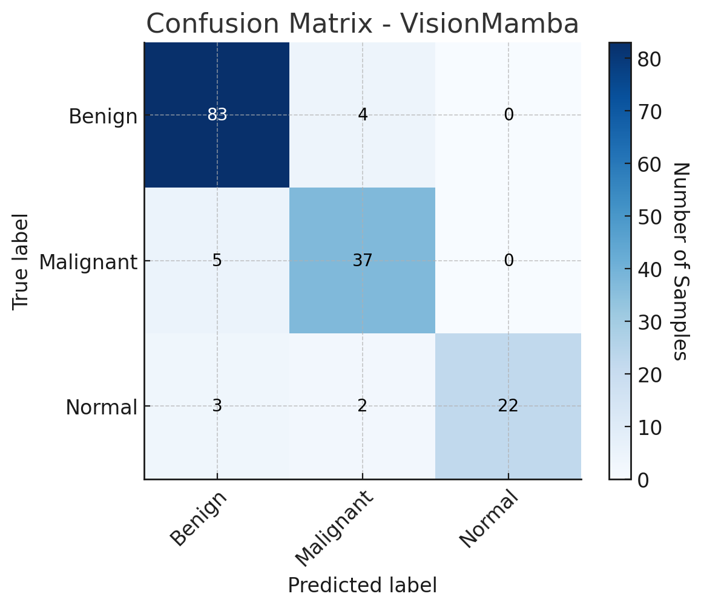
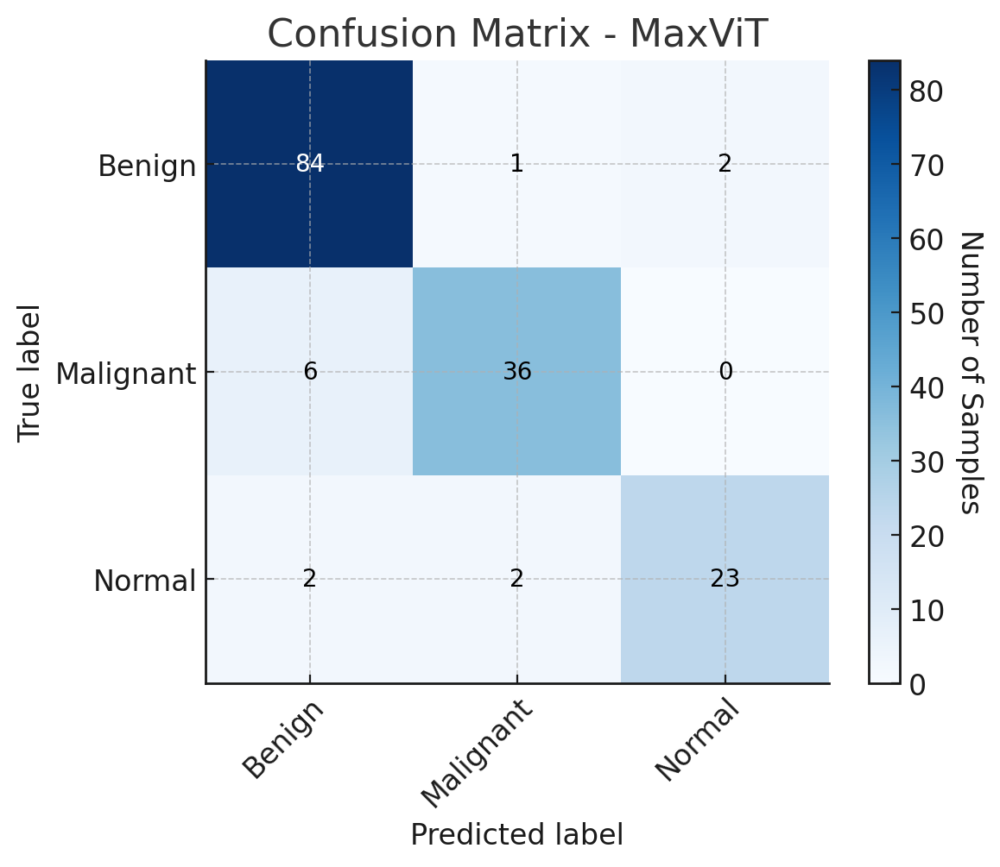
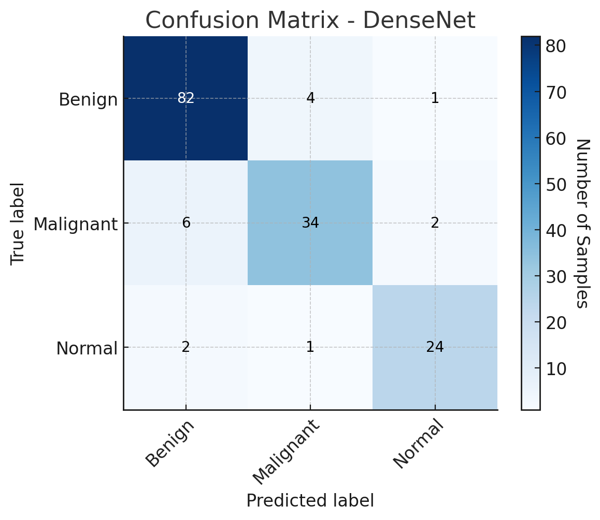
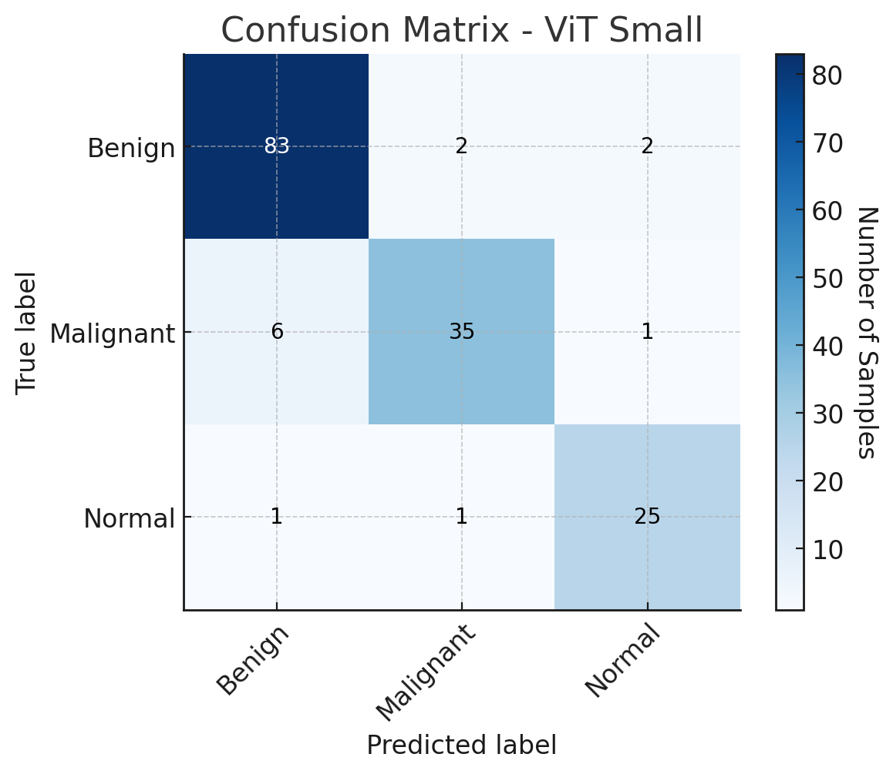
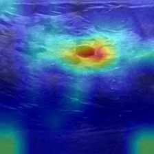
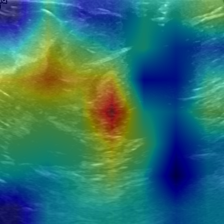
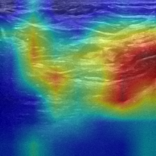

# UltraScanNet: A Mamba-Inspired Hybrid Backbone for Breast Ultrasound Classification

## 📜 Abstract
UltraScanNet combines:
- **Convolutional Stem** with learnable 2D positional embeddings  
- **Hybrid Stage** with MobileViT blocks, spatial gating, and convolutional residuals  
- **Progressively Global Stages** using a depth-aware mix of:
  1. **UltraScanUnit** — a state-space module with selective scan, gated convolutional residuals, and low-rank projections  
  2. **ConvAttnMixers** — spatial-channel mixing modules  
  3. **Multi-Head Self-Attention Blocks** — for global reasoning  

A detailed ablation study evaluates the individual and combined contributions of each component.

## 📊 Performance on BUSI Dataset
UltraScanNet achieves:
- **Top-1 Accuracy:** **91.67%**
- **Precision:** **0.9072**
- **Recall:** **0.9174**
- **F1-Score:** **0.9096**

### 📈 Comparison with SOTA Models
| Model              | Top-1 Accuracy (%) |
|--------------------|--------------------|
| **UltraScanNet**   | **91.67**          |
| ViT-Small          | 91.67              |
| MaxViT-Tiny        | 91.67              |
| MambaVision        | 91.02              |
| Swin-Tiny          | 90.38              |
| ConvNeXt-Tiny      | 89.74              |
| ResNet-50          | 85.90              |

UltraScanNet ranks among the **top-performing models**, providing competitive accuracy with fewer parameters compared to several transformer-based backbones.

## 🧪 Key Features
- **Learnable 2D Positional Embeddings** in the early convolutional stem  
- **Hybrid Local-Global Encoding** for efficient feature extraction  
- **Depth-Aware Operation Scheduling** (UltraScanUnit → ConvAttnMixer → MHSA)  
- **Extensive Benchmarking** against CNN, Transformer, and Mamba-based architectures  
- **Per-Class & Global Performance Analysis**


## 📊 Confusion Matrices

Below are the confusion matrices for 5 evaluated models on the BUSI dataset:

| UltraScanNet | MambaVision Baseline | 
|--------------|----------------------|
|  |  | 

| MaxViT-Tiny | DenseNet-121 | ViT-Small |
|-------------|--------------| -----------|
|  |  |  |


## 🔍 Grad-CAM Visualizations

Grad-CAM helps visualize which regions of the breast ultrasound images contributed most to the model’s decision.  
Below are some examples from **UltraScanNet** for each class:

| Benign | Malignant | Normal |
|--------|-----------|--------|
|  |  |  |


## Reproducibility Guide

This section describes the exact workflow used in this repository to reproduce training and evaluation runs.

### 1) Environment setup

```bash
cd /path/to/UltraScanNet
python3 -m venv venv
source venv/bin/activate
pip install -r requirements.txt

# Extra runtime dependencies used by training/validation scripts
pip install mamba_ssm --no-build-isolation
pip install torchinfo matplotlib scikit-learn thop
```

### 2) Paths and data/weights setup

All runtime paths are read from [paths.yaml](paths.yaml). Keep them repo-relative for portability.

Prepare dataset split and baseline weights:

```bash
python3 setup_dataset.py
python3 setup_weights.py
```

### 3) Baseline training (BUSI)

Local launcher:

```bash
python3 ultrascannet/launch_experiments.py
```

Or SLURM (recommended on cluster):

```bash
sbatch slurm_scripts/training.slurm
```

For full launch script execution under SLURM:

```bash
sbatch slurm_scripts/launch_experiments.slurm
```

### 4) Ablation run

Local launcher:

```bash
python3 ultrascannet/launch_experiments_ablation.py
```

Or SLURM:

```bash
sbatch slurm_scripts/launch_experiments_ablation.slurm
```

### 5) Validation / extended metrics

Local launcher:

```bash
python3 ultrascannet/launch_validation.py
```

Or SLURM:

```bash
sbatch slurm_scripts/evaluation.slurm
```

### 6) Where metrics are written

Per-experiment training outputs are written to:

- `weights/<experiment_name>/summary.csv` (epoch-by-epoch train/eval metrics)
- `weights/<experiment_name>/best.txt` (best top1 + epoch)
- `weights/<experiment_name>/model_best.pth.tar` (best checkpoint)

SLURM logs are written to:

- `slurm_logs/training_<jobid>.out/.err`
- `slurm_logs/launch_experiments_<jobid>.out/.err`
- `slurm_logs/launch_ablation_<jobid>.out/.err`
- `slurm_logs/evaluation_<jobid>.out/.err`

Evaluation logs include extended metrics (precision/recall/F1, classwise stats, AUC, confusion matrix).

### 7) Consolidated run summaries

Generated summaries across runs are saved in:

- `ultrascannet/metrics/run_metrics_summary.csv`
- `ultrascannet/metrics/run_metrics_success_only.csv`

These can be regenerated by rerunning the scripts; they are not required source files.

### Notes for paper-consistent runs

- Use the BUSI split generated by `setup_dataset.py` (80/20 stratified split).
- Do not change model architecture/config if you are comparing against baseline values.
- Prefer SLURM scripts in `slurm_scripts/` to ensure consistent environment setup and logging.


### 📥 Pretrained Weights & Configurations

We provide **pretrained weights** and the **configuration files** so that you can reproduce our results.

- **OneDrive Link:** [Download Here](https://uptro29158-my.sharepoint.com/:f:/g/personal/alexandra_laicu-hausberger_student_upt_ro/Em88eUDjtxBKmFMdmV75XBYB-AmQabzwnSjD-IzuwCstqA)